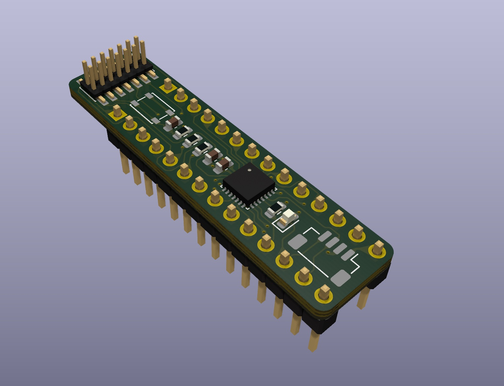

# BreadBar

Minimal STM32G0 prototyping board.

## PCB

* [Schematics](docs/breadbar.pdf)
* [Gerber files](docs/breadbar_rev_0x01.zip)
* [Order PCB on OSHPark](https://oshpark.com/shared_projects/HnaNiZUA)

## Pinout

## License

Licensed under either of

- Apache License, Version 2.0 ([LICENSE-APACHE](LICENSE-APACHE) or
  http://www.apache.org/licenses/LICENSE-2.0)
- MIT license ([LICENSE-MIT](LICENSE-MIT) or http://opensource.org/licenses/MIT)

at your option.

### Contribution

Unless you explicitly state otherwise, any contribution intentionally submitted
for inclusion in the work by you, as defined in the Apache-2.0 license, shall be
dual licensed as above, without any additional terms or conditions.
